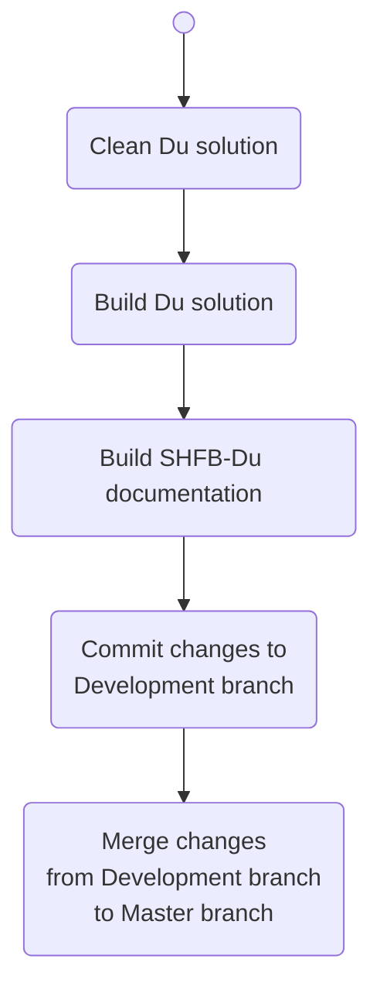

Du is a class libary that provides a set of tools and utilities for developers.

```mermaid
flowchart TB
  %% Components
  Start@{shape: sm-circ, label: "Start\n[sm-circ]"}
  CleanSolution@{shape: rounded, label: "Clean Du solution"}
  BuildSolution@{shape: rounded, label: "Build Du solution"}
  BuildSandcastle@{shape: rounded, label: "Build SHFB-Du documentation"}
  CommitChanges@{shape: rounded, label: "Commit changes to\nDevelopment branch"}
  MergeChanges@{shape: rounded, label: "Merge changes\nfrom Development branch\nto Master branch"}
  %% Layout
  Start --> CleanSolution --> BuildSolution --> BuildSandcastle --> CommitChanges --> MergeChanges   
  %% Styles
```